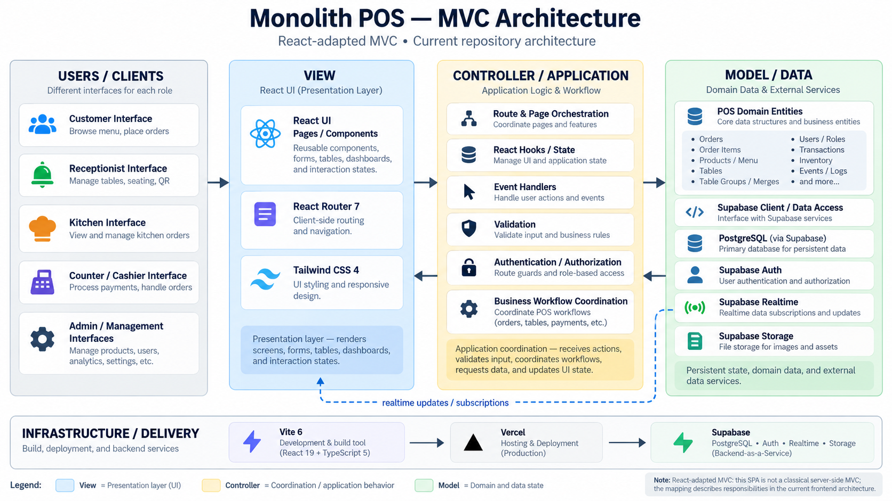

# Monolith POS

A modern, real-time, multi-interface web-based Point-of-Sale (POS) and restaurant management system built with **React 19**, **TypeScript**, **Vite 6**, **Tailwind CSS 4**, and **Supabase**.

Designed for high-throughput restaurant environments, Monolith connects dining guests, kitchen dispatchers, service staff, cashiers, receptionists, and managers into a single synchronized operational ecosystem.

---

## Architecture Overview (MVC Pattern)

Monolith adapts the classic **Model-View-Controller (MVC)** architectural pattern to modern single-page applications (SPAs) and Backend-as-a-Service (BaaS) infrastructure:



> **Note:** As illustrated in the diagram, this SPA adapts MVC for a reactive frontend architecture: the **View** renders UI and captures interactions, the **Controller** coordinates application logic, guards, and workflows, and the **Model** encapsulates persistent domain data, Supabase clients, and real-time streaming subscriptions.

### Architectural Breakdown

```text
┌────────────────────────────────────────────────────────────────────────────────────────┐
│                                       USERS / CLIENTS                                  │
│  Customer QR • Advance Orders • Receptionist • Kitchen / Dispatcher • Cashier • Admin  │
└──────────────────────────────────────────┬─────────────────────────────────────────────┘
                                           │ (Interactions & Events)
                                           ▼
┌────────────────────────────────────────────────────────────────────────────────────────┐
│                              VIEW (Presentation Layer)                                 │
│  • React 19 UI Components (Modals, Forms, Floor Plan, Floating Action Bars)            │
│  • React Router 7 (Declarative client-side routing & code-split lazy loading)          │
│  • Tailwind CSS 4 (Modern CSS-first styling, curated color system & micro-animations)  │
└───────────────────▲──────────────────────────────────────┬─────────────────────────────┘
                    │                                      │ (Dispatched User Actions)
                    │ (UI Re-render on State Change)       ▼
┌───────────────────┴────────────────────────────────────────────────────────────────────┐
│                    CONTROLLER / APPLICATION (Logic & Orchestration)                    │
│  • Route & Page Orchestration (Multi-role route workflows & layout shells)             │
│  • React Hooks & State Management (useAuth, useCart, useOrders, useBillRequest, etc.)  │
│  • Event Handlers & Business Workflows (Order progression, cooking queues, billing)   │
│  • Validation & Guard Logic (Geolocation radius checks, day verification, stock checks)│
│  • Authentication & Authorization (Route guards: Kitchen, Cashier, Service, Customer)  │
└───────────────────▲──────────────────────────────────────┬─────────────────────────────┘
                    │                                      │ (Queries & Mutations)
                    │ (Realtime Broadcasts & Data Streams) ▼
┌───────────────────┴────────────────────────────────────────────────────────────────────┐
│                        MODEL / DATA (Domain Data & External BaaS)                      │
│  • POS Domain Entities (Orders, Order Items, Menu Items, Tables, Discounts, Shifts)   │
│  • Supabase Client Singleton (@supabase/supabase-js typed data access)                │
│  • PostgreSQL Database (Relational integrity, CHECK constraints, triggers, indexes)    │
│  • Supabase Auth (JWT session management, secure staff credentials)                   │
│  • Supabase Realtime Channels (PostgreSQL CDC WebSockets, Presence & Broadcasts)       │
│  • Supabase Storage (Base64 data URIs and cloud bucket asset storage)                  │
└────────────────────────────────────────────────────────────────────────────────────────┘
```

#### 1. View (Presentation Layer)
- **React 19 Components**: Composable UI components including responsive cards, modals, animated toast alerts, interactive floor plans, and mobile action bars.
- **React Router 7**: Declarative routing with route guards, lazy loading via `React.lazy()` and `<Suspense>`, and deep-linking support (e.g., `/customer/:tableId`, `/advance-order/:token`).
- **Tailwind CSS 4**: High-performance CSS-first utility styling powered by `@tailwindcss/vite`, responsive layouts, and smooth micro-animations.

#### 2. Controller / Application (Logic & Orchestration)
- **Workflow Coordination**: Manages the complete lifecycle of orders (`REQUESTED` ➔ `VERIFIED` ➔ `PREPARING` ➔ `READY` ➔ `SERVED` ➔ `COMPLETED`).
- **State & Custom Hooks**: Encapsulates application state (`useAuth`, `useCart`, `useMenu`, `useOrders`, `useBillRequest`, `useRealtimeMenu`).
- **Route Guards & Security**: Enforces access boundaries using `ProtectedRoute`, `KitchenRouteGuard`, `CashierRouteGuard`, `ServiceRouteGuard`, `CustomerLocationGuard`, and `CustomerDayGuard`.
- **Validation & Geofencing**: Validates customer physical proximity via browser Geolocation API before permitting table ordering.

#### 3. Model / Data (Domain Data & External Services)
- **Domain Entities**: Typed models for tables, orders, line items, categories, discounts, cashier shifts, events, and audit logs.
- **Supabase Integration**: Unified client singleton interfacing with PostgreSQL, authentication, and cloud storage.
- **Dual-Channel Synchronization**: Combines **Supabase Realtime WebSockets** (instant change delivery) with **silent background polling** (2.5s–5s intervals) and browser tab visibility re-sync, guaranteeing zero-flicker resilience in unstable restaurant Wi-Fi networks.

---

## Core Interfaces & User Roles

Monolith provides dedicated, tailored interfaces for every role in restaurant operations:

| Interface | Route | Primary Role | Key Capabilities |
|---|---|---|---|
| **Customer QR Ordering** | `/customer/:tableId` | Dining Guests | Contactless ordering, dish customization, floating checkout bar, unified tickets hub, 5-option staff assistance call, live order status updates |
| **Advance Ordering** | `/advance-order/:token` | Remote / Event Guests | Scheduled pre-ordering with tokenized access for catering, events, and advance dining reservations |
| **Receptionist Interface** | `/reception` | Host / Greeter | Real-time floor plan view, guest seating, table availability tracking, and QR code assignment |
| **Order Viewer** | `/order-viewer` | Kitchen Staff | Distraction-free, read-only live ticket monitor sorted chronologically |
| **Dispatcher Interface** | `/dispatcher` | Kitchen Dispatcher | Stock verification, 3-stage queue (`PREPARING`, `COOKING`, `DISPATCHED`), grouped items, item-level completion counters, cancellation with reason logging, global out-of-stock toggling |
| **Service Interface** | `/service` | Floor Waitstaff | Live assistance requests feed (Water, Waiter, Utensils, Bill Out, Other) with instant acknowledgement, order status tracking |
| **Cashier Interface** | `/cashier` | Cashier | Table checkout, bill calculation, senior/PWD/custom discounts, split payments (`CASH`, `CREDIT_CARD`, `INSTAPAY_QR`), shift management, cash float tracking, printable PDF receipts |
| **Layout Manager** | `/tables` | Management | Interactive drag-and-drop floor plan designer, table grouping/merging, capacity configuration, printable QR codes with PDF batch export |
| **Menu Manager** | `/menu` | Management | Category management, dish catalog, pricing, recipe notes, Base64/cloud imagery, instant stock toggles |
| **Analytics** | `/analytics` | Management / Owners | Real-time sales insights, revenue graphs, order volume trends, popular items, business day opening/closing metrics |
| **Events Manager** | `/events` | Event Coordinators | Event calendar, scheduled reservations, private dining coordination |
| **Account Manager** | `/accounts` | Administrators | Staff credentials, role assignments, access permissions, PIN/passcode verification |
| **Order Logs** | `/order-logs` | Administrators / Audit | Comprehensive audit trail of historical orders, item breakdown, payment records, cashier shift linkages |

---

## Key Highlights & Operational Workflows

### 1. Dual-Channel Realtime Resilience
In busy dining rooms, network instability can cause dropped WebSocket connections. Monolith solves this with a multi-layered sync strategy:
- **Supabase Realtime**: Instant PostgreSQL CDC (Change Data Capture) and broadcast channels.
- **Silent Background Polling**: A non-intrusive 2.5s–5s polling fallback that updates state without triggering page-level loading spinners.
- **Visibility Synchronization**: Automatic re-fetch triggered when a device or browser tab regains focus.

### 2. Kitchen-First Order Verification
To eliminate discrepancies where a customer orders an item that just ran out in the kitchen:
1. Customer submits order ➔ Status is set to `REQUESTED`.
2. Kitchen Dispatcher reviews items against live inventory.
3. If valid, Dispatcher accepts ➔ Status moves to `VERIFIED`, immediately alerting the Cashier and Customer.
4. If an ingredient is exhausted, Dispatcher rejects item with a recorded reason (`only_X_left` or `unavailable`) and optionally marks the dish globally as `OUT_OF_STOCK`.

### 3. Customer Mobile Experience & Geofencing
- **Geofencing Protection**: The `CustomerLocationGuard` verifies physical presence within a configurable GPS radius around the restaurant to prevent unauthorized remote ordering.
- **1-Tap Dish Adding**: Instant addition to dish queue with non-blocking feedback.
- **Floating Cart / Place Order Bar**: Stays fixed above the bottom navigation bar (`fixed bottom-[80px] inset-x-0 z-30`), keeping Menu, Orders, and Assist tabs accessible at all times.
- **Assistance Modal**: One-tap requests for Water, Waiter, Utensils/Napkins, or Bill Out with live sync of staff acknowledgement.
- **Conditional Bill Out**: The Bill Out button activates only after all active table orders have reached `SERVED` status.

### 4. Cashier Shift & Financial Controls
- **Shift Lifecycle**: Opening floats, ongoing cash/card/QR tally, closing counts, and automatic cash discrepancy calculation.
- **Discounts Engine**: Compliant Senior Citizen & PWD discounts (with headcount inputs), custom percentage discounts, and fixed peso reductions.
- **Printable Receipts**: Native receipt generation and formatted layout ready for thermal or standard printing via `jspdf`.

---

## Technology Stack

| Layer | Technology | Version | Purpose |
|---|---|---|---|
| **Frontend Framework** | React | 19.x | Modern UI rendering with Concurrent features |
| **Language** | TypeScript | 5.8+ (Strict) | End-to-end type safety and domain models |
| **Build Tool & Bundler** | Vite | 6.x | Blazing fast HMR, optimized production builds |
| **Routing** | React Router | 7.x | Nested layouts, data loaders, code-split routes |
| **Styling & Design** | Tailwind CSS | 4.x | CSS-first configuration via `@tailwindcss/vite` |
| **Database & Auth** | Supabase | 2.x | PostgreSQL, Auth, Realtime WebSockets, Storage |
| **Icons** | Lucide React | Latest | Consistent, lightweight iconography |
| **PDF & QR Generation** | jsPDF / qrcode | Latest | Table QR generation and receipt printing |
| **Hosting & Edge** | Vercel | Production | SPA rewrite edge deployment |

---

## Database Schema Overview

The underlying database runs on **PostgreSQL** hosted on **Supabase**. All identifiers adhere to quoted uppercase snake-case conventions:

```
Restaurant_Tables
  ├── Restaurant_Orders (TABLE_ID)
  │     └── Order_Items (ORDER_ID)
  │           ├── Menu_Items (ITEM_ID)
  │           │     └── Menu_Categories (CATEGORY_ID)
  │           └── Discounts (ORDER_ITEM_ID / ORDER_ID)
  └── Bill_Requests (TABLE_ID, ORDER_ID)
```

### Order Status Progression

```text
[ REQUESTED ] ──(Kitchen Confirms)──► [ VERIFIED ]
      │                                     │
(Kitchen Rejects)                     (To Cooking)
      ▼                                     ▼
[ CANCELLED ]                         [ PREPARING ]
                                            │
                                      (All Items Cooked)
                                            ▼
                                        [ READY ]
                                            │
                                      (Waitstaff Serves)
                                            ▼
                                       [ SERVED ]
                                            │
                                      (Cashier Settles Bill)
                                            ▼
                                      [ COMPLETED ]
```

---

## Project Structure

```text
monolith-pos/
├── public/
│   ├── MVC.png                  # System MVC Architecture Diagram
│   ├── favicon.png              # App branding icon
│   └── favicon.svg
├── src/
│   ├── assets/                  # Logos and static illustrations
│   ├── components/
│   │   ├── auth/                # ProtectedRoute and authentication guards
│   │   ├── cashier/             # CashierRouteGuard and cashier components
│   │   ├── common/              # PageLoader and universal loading spinners
│   │   ├── customer/            # CustomerLocationGuard, DayGuard, ordering sheets
│   │   ├── kitchen/             # KitchenRouteGuard and cooking queue elements
│   │   ├── layout/              # AppHeader, AppSidebar, NavigationItem
│   │   ├── receipt/             # buildReceipt utility and thermal print templates
│   │   ├── table-qr/            # QR code generation and PDF print exporter
│   │   └── ui/                  # Button, Card, Input, EmptyState, PageHeader
│   ├── config/                  # app.ts, navigation.ts (Single source of truth)
│   ├── contexts/                # AuthContext, LocationVerificationContext
│   ├── hooks/                   # useAuth, useCart, useMenu, useOrders, useBillRequest
│   ├── layouts/                 # AppLayout (Authenticated shell), RootLayout (Public)
│   ├── lib/                     # supabase.ts (Singleton client instance)
│   ├── pages/                   # Lazy-loaded page components for all 12+ interfaces
│   ├── routes/                  # Centralized React Router 7 createBrowserRouter config
│   ├── services/                # Business logic & Supabase database services
│   ├── styles/                  # index.css (Tailwind 4 tokens & micro-animations)
│   ├── types/                   # TypeScript interfaces (Order, Menu, Table, Account, etc.)
│   └── utils/                   # Formatting, date helpers, calculations
├── Context/                     # Full SQL schemas, migrations, and architecture documentation
├── index.html                   # HTML entry point with Google Fonts (Plus Jakarta Sans)
├── package.json                 # Project dependencies and npm scripts
├── tsconfig.json                # TypeScript compiler configuration
├── vercel.json                  # Vercel SPA rewrite configuration
└── vite.config.ts               # Vite configuration with Tailwind CSS & SSL plugins
```

---

## Design System & Color Palette

Monolith uses a curated, premium color palette designed for high contrast and legibility across mobile devices and kitchen displays:

| Token | Hex | Role & Usage |
|---|---|---|
| `--color-primary` | `#14274E` | Deep Navy: Primary brand color, headers, navigation bars, prominent typography |
| `--color-secondary` | `#394867` | Navy Blue-Gray: Secondary text, borders, structured card outlines |
| `--color-accent` | `#E9C46A` | Warm Gold / Yellow: Primary action buttons, badges, highlights, call-to-action |
| `--color-background` | `#F1F6F9` | Off-White / Soft Gray: Screen backgrounds, clean contrast backdrop |
| `--color-muted` | `#9BA4B4` | Light Slate: Subdued icons, disabled buttons, secondary meta-labels |
| `--color-danger` | `#C94A4A` | Crimson Red: Destructive actions, out-of-stock badges, error states |

**Typography**: [Plus Jakarta Sans](https://fonts.google.com/specimen/Plus+Jakarta+Sans) via Google Fonts for clean legibility on touch screens and thermal prints.

---

## Getting Started

### Prerequisites
- **Node.js**: `v18.0.0` or higher
- **npm** / **yarn** / **pnpm**
- A **Supabase** project with PostgreSQL and Realtime enabled

### 1. Clone & Install Dependencies

```bash
git clone https://github.com/HighOnKohi/monolith-pos.git
cd monolith-pos
npm install
```

### 2. Configure Environment Variables

Create a `.env` file in the root directory:

```env
VITE_SUPABASE_URL=https://your-project-id.supabase.co
VITE_SUPABASE_ANON_KEY=your-anon-publishable-key
VITE_PUBLIC_APP_URL=https://your-domain.vercel.app
```

> **Security Note:** Never expose `SUPABASE_SERVICE_ROLE_KEY` or any administrative secrets to client-side code.

### 3. Run Development Server

```bash
npm run dev
```

The application will start on `http://localhost:5173`. Access role interfaces via:
- Staff Login: `http://localhost:5173/login`
- Customer Table View: `http://localhost:5173/customer/table-1?local=true`
- Dispatcher: `http://localhost:5173/dispatcher`
- Cashier: `http://localhost:5173/cashier`

### 4. Build for Production

```bash
npm run build
```

Previews the production bundle locally:

```bash
npm run preview
```

### 5. Code Quality & Linting

```bash
npm run lint
```

---

## Deployment

The application is optimized for deployment on **Vercel**. Single Page Application (SPA) routing is handled via `vercel.json`:

```json
{
  "rewrites": [
    { "source": "/(.*)", "destination": "/index.html" }
  ]
}
```

Pushing commits to the connected repository automatically triggers continuous integration and deployment on Vercel.

---

## License

This project is developed as an academic thesis project. All rights reserved.
